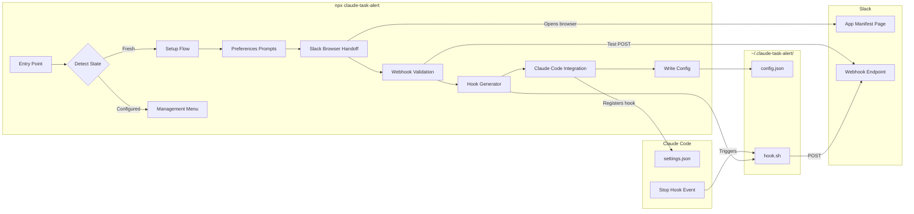
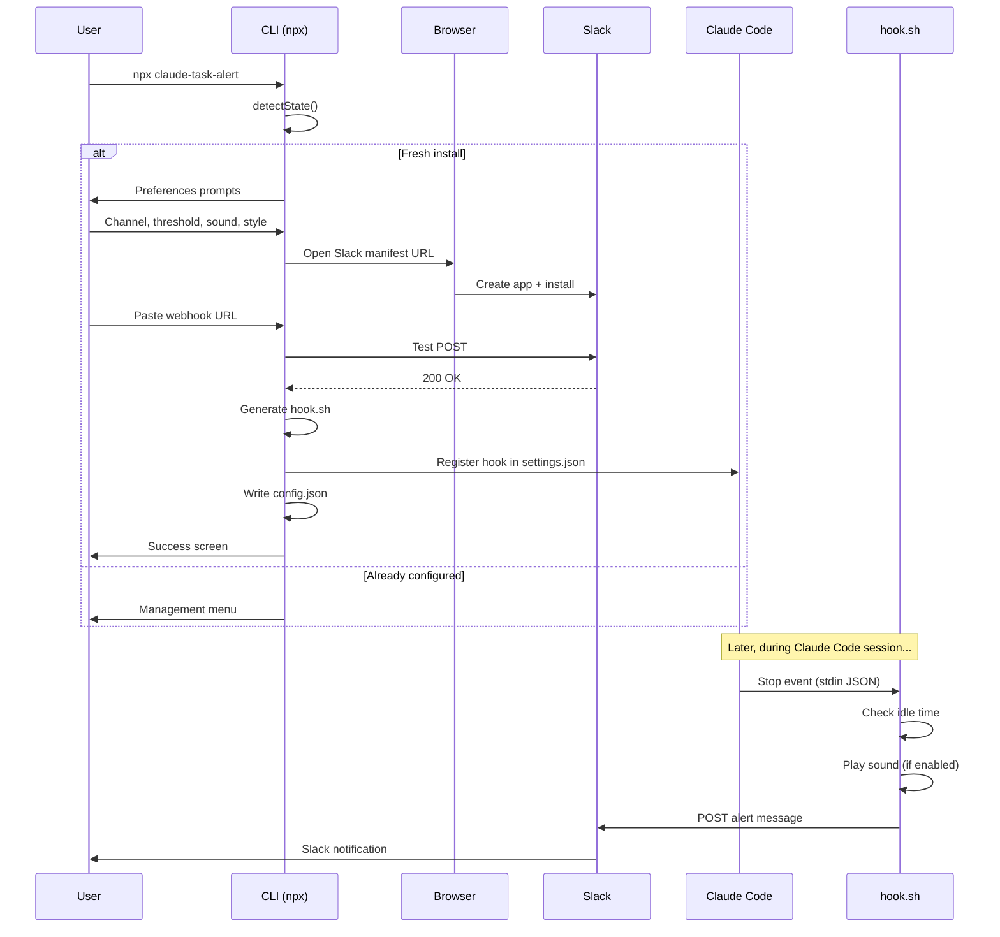

# Architecture — Claude Task Alert

> Living document. Updated with every structural change.

---

## System Diagram

---

## Component Responsibilities

| Component | File | Role |
|---|---|---|
| Entry point | `src/index.ts` | CLI bin entry, state detection, flow routing, SIGINT handler, top-level error handler |
| Config manager | `src/config.ts` | Config type definitions, read/write `config.json`, `detectState()`, write-access check |
| Setup flow | `src/setup.ts` | First-run interactive prompts (channel, threshold, sound, style). Returns `SetupResult` |
| Slack connector | `src/slack.ts` | Manifest generation, browser handoff, webhook paste + validation, test POST with retry loop |
| Hook generator | `src/hook.ts` | OS/platform detection, idle/sound command resolution, `hook.sh` template generation + writer |
| Claude Code integration | `src/integration.ts` | settings.json read/write, hook registration/dedup, final config write, success screen |
| Management menu | `src/menu.ts` | Re-run menu: update prefs, change Slack, test alert, uninstall |

---

## Data Flow

---

## Key Design Decisions

| Decision | Rationale |
|---|---|
| Manifest-based Slack app (Option C) | No backend infra, user owns app, minimal friction, zero cost |
| `incoming-webhook` scope only | Minimal permissions — write-only, no message reading |
| Config in `~/.claude-task-alert/` | Consistent location, survives project switches, easy to find/delete |
| Shell script for hook (not Node) | Hooks must be fast + lightweight — no Node startup overhead on every Claude stop |
| Graceful degradation for sound/idle | Core value is Slack alerts; sound/idle are nice-to-haves per platform |

---

*Last updated: 2026-03-26*
