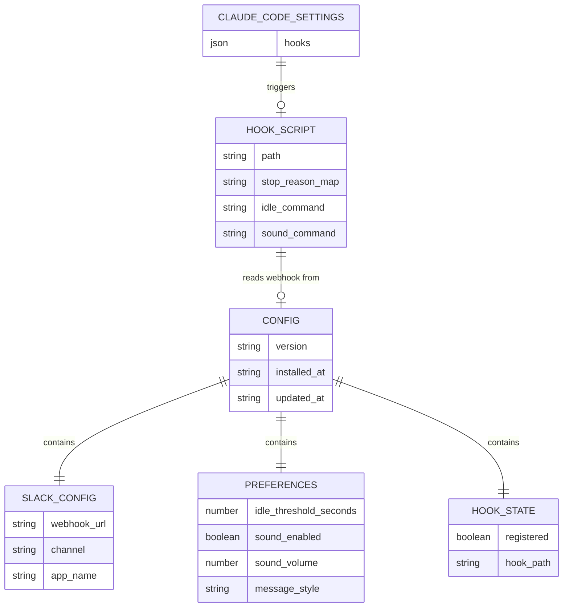
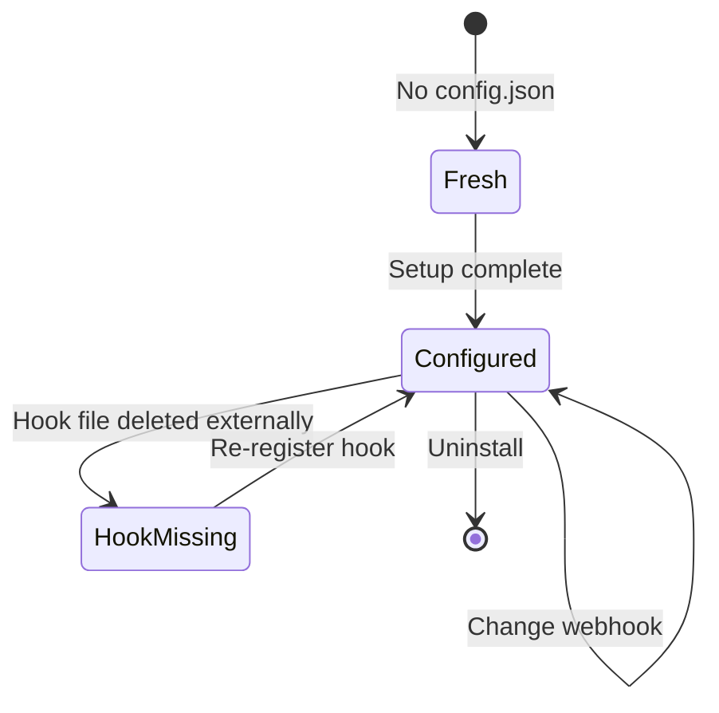

# Data Model — Claude Task Alert

> No database. All state is file-based. This doc covers the file-based data model.

---

## Entity Relationship

---

## File Locations

| File | Path | Owner | Purpose |
|---|---|---|---|
| Config | `~/.claude-task-alert/config.json` | CLI | All user preferences + connection state |
| Hook script | `~/.claude-task-alert/hook.sh` | CLI (generated) | Executed by Claude Code on stop events |
| Claude Code settings | Platform-dependent `settings.json` | Claude Code | Hook registration |

---

## Config Lifecycle

